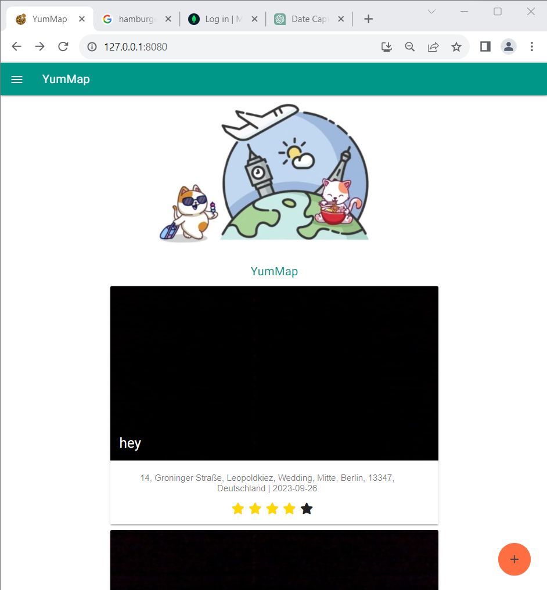

# YumMap - Aktuelle Trends der IKT 2023

## Inhaltsverzeichnis
1. [Allgemeine Informationen](#allgemeine-information)
2. [Information zur Anwendung](#information-zur-anwendung)
3. [Installation](#installation)
4. [Technologien](#technologien)

### Allgemeine Information
***
Die Anwendung ist dazu gedacht, dass wenn man irgendwo essen war, man ein Foto entweder vom Laden oder vom Esseb macht den Namen des Ortes und den Standort eingibt. 
Ebenso gibt man dem ganzen dann auch noch eine Bewertung in Form von Sternen (1 Stern = nicht gut, 5 Sterne = sehr gut), wenn man kein Stern ausfüllt werden am Ende 5 schwarze Sterne auf dem Post hinterlassen.

### Information zur Anwendung
***
#### Feed/Bilder:

Das ist der Feed, wo die ganzen Posts zu sehen sind die man erstellt hat. Das älteste ist ganz oben und die neusten ganz unten.

#### CreatePost (+):

Wenn man auf das Plus klickt, dass unten in der rechten Ecke schwebt, kann man einen neuen post erstellen.

Buttons:

Foto: erstellt das Foto
Location: erstellt automatisch den exacten Standort für das Inputfeld Ort
Speicher: die Einträge werden gespeichert und in die Datenbank eingetragen
X: Vorgang wird abgebrochen

#### Hamburger-Menü:

- Damit kann man zur Hilfe-seite springen
- Benachrichtigungen einschalten
- Die PWA installieren

## Installation

1. Repository clonen  
[GitHub Repository ](https://github.com/semanur03/YumMap_ikt.git)

2. Frontend

- Zum Starten des Projektes wechseln Sie im Terminal (Terminal Ihres Rechners oder das Terminal in der IDE) in den Projektordner (`YumMap_ikt`) und führen dort 

	`npm install` 

	aus. Damit werden alle erforderlichen Abhängigkeiten installiert.

- Nach erfolgreicher Installation der Abhängigkeiten, geben Sie  

	`npm start` 

	ein, um Ihr Projekt auszuführen. Klicken Sie danach auf [localhost:8080](http://localhost:8080) oder geben Sie die URL direkt in Ihren Browser ein.

- Sollten Sie Änderungen an der IMplementierung vornehmen und diese ausprobieren wollen, müssen Sie den Server zunächst wieder stoppen:

	`Ctrl-C`

	und geben dann erneut 

	`npm start` 

	ein. 

3. Backend

- Zum Starten des Backendes wechseln Sie im Terminal (Terminal Ihres Rechners oder das Terminal in der IDE) in den Projektordner (`YumMap_ikt/backend`) und erstellen dort

	`.env`-Datei

	Das Backend ist ohne ein Zertigfikat mit MongoDB verbunden
	
	DB_CONNECTION = (Ihr Link zur verbindung mit MongoDB Atlas)
	DATABASE =YumMap
	COLLECTION=posts
	PORT=3000	

- `npm i`
- `npm run watch`

### Technologien
*** 
1. Visual Studio Code
2. MongoDB
3. Node.js
4. Material Design Lite